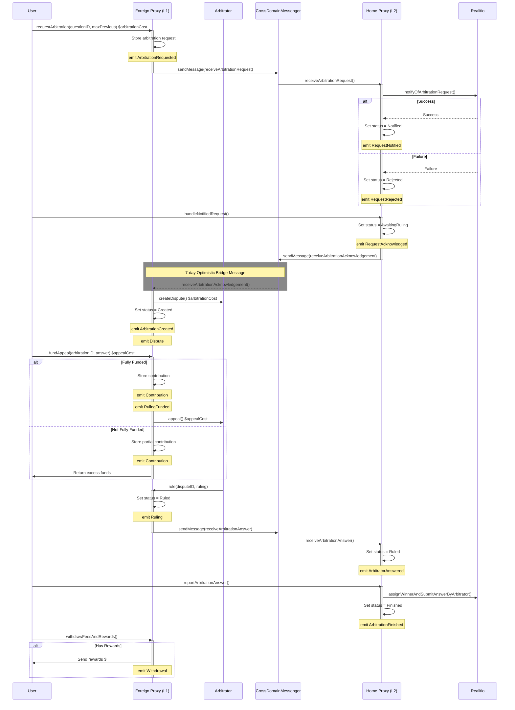

# @kleros/cross-chain-realitio-contracts

Smart contracts for the Reality.eth cross-chain proxies.

---
- **[Deployments](#deployments)**
  - **[Mainnets](#mainnets)**
    - **[Gnosis](#gnosis)**
    - **[Unichain](#unichain)**
    - **[Base](#base)**
    - **[Polygon](#polygon)**
  - **[Testnets](#testnets)**
    - **[Chiado](#chiado)**
    - **[UnichainSepolia](#unichainsepolia)**
    - **[OptimismSepolia](#optimismsepolia)**
    - **[ArbitrumSepolia](#arbitrumsepolia)**
    - **[ZksyncSepolia](#zksyncsepolia)**
- **[Sequence diagram](#sequence-diagram)**
- **[Contributing](#contributing)**
  - **[Install Dependencies](#install-dependencies)**
  - **[Run Tests](#run-tests)**
  - **[Compile the Contracts](#compile-the-contracts)**
  - **[Deploy Instructions](#deploy-instructions)**
    - **[0. Set the Environment Variables](#0-set-the-environment-variables)**
    - **[1. Update the Constructor Parameters (optional)](#1-update-the-constructor-parameters-optional)**
    - **[2. Deploy the Proxies](#2-deploy-the-proxies)**
---

## Deployments

Refresh the list of deployed contracts by running `./scripts/populateReadme.sh`.

### Mainnets

#### Gnosis

| Version | Name | Home Proxy | Foreign Proxy | CourtID | MinJurors | Reality | Policy | Comment |
|---------|------|------------|---------------|---------|-----------|---------|---------|---------|
| v1.1.2 | [Default 2](deployments/gnosis/RealitioProxy-v1.1.2.json#L6) | [0x68154E..7491Dc](https://gnosisscan.io/address/0x68154EA682f95BF582b80Dd6453FA401737491Dc) | [0xFe0eb5..c0Aa68](https://etherscan.io/address/0xFe0eb5fC686f929Eb26D541D75Bb59F816c0Aa68) | 0 | 31 | [RealityETH_v3_0](https://gnosisscan.io/address/0xE78996A233895bE74a66F451f1019cA9734205cc) | [seer](https://cdn.kleros.link/ipfs/QmPmRkXFUmzP4rq2YfD3wNwL8bg3WDxkYuvTP9A9UZm9gJ/seer-markets-resolution-policy.pdf) |  |
| v1.1.1 | [Polkamarkets Foreland](deployments/gnosis/RealitioProxy-v1.1.1.json#L6) | [0x5AFa42..86F90e](https://gnosisscan.io/address/0x5AFa42b30955f137e10f89dfb5EF1542a186F90e) | [0x8453bA..552425](https://etherscan.io/address/0x8453bA2C9eA5Bae36fDe6cBd61c12c05b6552425) | 0 | 5 | [RealityETH_ERC20_v3_0](https://gnosisscan.io/address/0x934326a86A99DaB25bB8329089ce73ed9c7c0E4a) | [default](https://cdn.kleros.link/ipfs/QmNV5NWwCudYKfiHuhdWxccrPyxs4DnbLGQace2oMKHkZv/Question_Resolution_Policy.pdf) | :warning: bad metadata |
| v1.1.1 | [Default](deployments/gnosis/RealitioProxy-v1.1.1.json#L29) | [0x29f39d..fce222](https://gnosisscan.io/address/0x29f39de98d750eb77b5fafb31b2837f079fce222) | [0x2F0895..695F21](https://etherscan.io/address/0x2F0895732bfacdCF2fdB19962fE609D0dA695F21) | 0 | 31 | [RealityETH_v3_0](https://gnosisscan.io/address/0xE78996A233895bE74a66F451f1019cA9734205cc) | [noAnswerTooSoon](https://cdn.kleros.link/ipfs/QmaUr6hnSVxYD899xdcn2GUVtXVjXoSXKZbce3zFtGWw4H/Question_Resolution_Policy.pdf) | :warning: bad metadata |
| v1.1.0 | [Omen AI bis](deployments/gnosis/RealitioProxy-v1.1.0.json#L6) | [0x5562ac..96cdf2](https://gnosisscan.io/address/0x5562ac605764dc4039fb6ab56a74f7321396cdf2) | [0xeF2Ae6..6B2f59](https://etherscan.io/address/0xeF2Ae6961Ec7F2105bc2693Bc32fA7b7386B2f59) | 0 | 31 | [Realitio_v2_1](https://gnosisscan.io/address/0x79e32aE03fb27B07C89c0c568F80287C01ca2E57) | [omen](https://cdn.kleros.link/ipfs/QmZM12kkguXFk2C94ykrKpambt4iUVKsVsxGxDEdLS68ws/omen-rules.pdf) | :warning: bad metadata |
| v1.0.0 | [Omen AI](deployments/gnosis/RealitioProxy-v1.0.0.json#L6) | [0xe40DD8..a75ecd](https://gnosisscan.io/address/0xe40DD83a262da3f56976038F1554Fe541Fa75ecd) | [0x79d046..eA3D49](https://etherscan.io/address/0x79d0464Ec27F67663DADf761432fC8DD0AeA3D49) | 0 | 500 | [Realitio_v2_1](https://gnosisscan.io/address/0x79e32aE03fb27B07C89c0c568F80287C01ca2E57) | [omen](https://cdn.kleros.link/ipfs/QmZM12kkguXFk2C94ykrKpambt4iUVKsVsxGxDEdLS68ws/omen-rules.pdf) | :warning: bad metadata |


#### Unichain

| Version | Name | Home Proxy | Foreign Proxy | CourtID | MinJurors | Reality | Policy | Comment |
|---------|------|------------|---------------|---------|-----------|---------|---------|---------|
| v1.3.0 | [Default](deployments/unichain/RealitioProxy-v1.3.0.json#L6) | [0xcB4B48..b045a6](https://uniscan.xyz/address/0xcB4B48d2A7a44247A00048963F169d2b4Ab045a6) | [0x122D6B..b7954D](https://etherscan.io/address/0x122D6B4197531bF4e9314fD00259b1dc1Db7954D) | 24 | 15 | [RealityUnverified](https://uniscan.xyz/address/0xB920dBedE88B42aA77eE55ebcE3671132ee856fC) | [default](https://cdn.kleros.link/ipfs/QmNV5NWwCudYKfiHuhdWxccrPyxs4DnbLGQace2oMKHkZv/Question_Resolution_Policy.pdf) |  |
| v1.3.0 | [Butter](deployments/unichain/RealitioProxy-v1.3.0.json#L29) | [0x8FeAB3..EC44b6](https://uniscan.xyz/address/0x8FeAB350A304140b1593A38a13607d122BEC44b6) | [0x3FB831..48Ac17](https://etherscan.io/address/0x3FB8314C628E9afE7677946D3E23443Ce748Ac17) | 24 | 15 | [RealityUnverified](https://uniscan.xyz/address/0xB920dBedE88B42aA77eE55ebcE3671132ee856fC) | [butter](https://cdn.kleros.link/ipfs/QmSv9ohhChMtyqwqsvfgeJtZQBWkwAboBc1n3UGvprfdd7/Conditional_Funding_Markets_-_Question_Resolution_Policy.pdf) |  |


#### Base

| Version | Name | Home Proxy | Foreign Proxy | CourtID | MinJurors | Reality | Policy | Comment |
|---------|------|------------|---------------|---------|-----------|---------|---------|---------|
| v1.3.0 | [Default](deployments/base/RealitioProxy-v1.3.0.json#L6) | [0xcB4B48..b045a6](https://basescan.org/address/0xcB4B48d2A7a44247A00048963F169d2b4Ab045a6) | [0x87f58F..e2EAf9](https://etherscan.io/address/0x87f58F0dCF3c99BA2F3eB0604e5c335893e2EAf9) | 24 | 15 | [RealityETH_v3_0](https://basescan.org/address/0x2F39f464d16402Ca3D8527dA89617b73DE2F60e8) | [default](https://cdn.kleros.link/ipfs/QmNV5NWwCudYKfiHuhdWxccrPyxs4DnbLGQace2oMKHkZv/Question_Resolution_Policy.pdf) |  |
| v1.3.0 | [Zodiac SafeSnap](deployments/base/RealitioProxy-v1.3.0.json#L29) | [0xBeeB21..FBe96B](https://basescan.org/address/0xBeeB211CfE6632E75992488A66F65b0477FBe96B) | [0x20E1D4..aAe373](https://etherscan.io/address/0x20E1D44c64Ec03ECe12133743bEc7019f3aAe373) | 24 | 15 | [RealityETH_v3_0](https://basescan.org/address/0x2F39f464d16402Ca3D8527dA89617b73DE2F60e8) | [zodiac](https://cdn.kleros.link/ipfs/QmXyo9M4Z2XY6Nw9UfuuUNzKXXNhvt24q6pejuN9RYWPMr/Reality_Module_Governance_Oracle-Question_Resolution_Policy.pdf) |  |


#### Polygon

| Version | Name | Home Proxy | Foreign Proxy | CourtID | MinJurors | Reality | Policy | Comment |
|---------|------|------------|---------------|---------|-----------|---------|---------|---------|
| v1.1.0 | [Default](deployments/polygon/RealitioProxy-v1.1.0.json#L6) | [0x5AFa42..86F90e](https://polygonscan.com/address/0x5AFa42b30955f137e10f89dfb5EF1542a186F90e) | [0x776e58..231e52](https://etherscan.io/address/0x776e5853e3d61B2dFB22Bcf872a43bF9A1231e52) | 0 | 31 | [RealityETH_v3_0](https://polygonscan.com/address/0x60573B8DcE539aE5bF9aD7932310668997ef0428) | [default](https://cdn.kleros.link/ipfs/QmNV5NWwCudYKfiHuhdWxccrPyxs4DnbLGQace2oMKHkZv/Question_Resolution_Policy.pdf) |  |
| v1.1.0 | [Polkamarkets](deployments/polygon/RealitioProxy-v1.1.0.json#L29) | [0x68154E..7491Dc](https://polygonscan.com/address/0x68154EA682f95BF582b80Dd6453FA401737491Dc) | [0x68c4cc..bAFE28](https://etherscan.io/address/0x68c4cc21378301cfdd5702D66D58a036D7bAFE28) | 0 | 31 | [RealityETH_ERC20_v3_0](https://polygonscan.com/address/0x83d3f4769A19F1B43337888B0290F5473cf508b2) | [default](https://cdn.kleros.link/ipfs/QmNV5NWwCudYKfiHuhdWxccrPyxs4DnbLGQace2oMKHkZv/Question_Resolution_Policy.pdf) |  |


### Testnets

#### Chiado

| Version | Name | Home Proxy | Foreign Proxy | CourtID | MinJurors | Reality | Policy | Comment |
|---------|------|------------|---------------|---------|-----------|---------|---------|---------|
| v1.3.0 | [Chiado default](deployments/chiado/RealitioProxy-v1.3.0.json#L6) | [0x87f58F..e2EAf9](https://gnosis-chiado.blockscout.com/address/0x87f58F0dCF3c99BA2F3eB0604e5c335893e2EAf9) | [0x781Bfb..904aE0](https://sepolia.etherscan.io/address/0x781Bfb3A7179e27D78c6d18bCc54A2af61904aE0) | 3 | 1 | [RealityUnverified](https://gnosis-chiado.blockscout.com/address/0x012fb3aDce7D60672cF634e730927Fa5822b3cAb) | [default](https://cdn.kleros.link/ipfs/QmNV5NWwCudYKfiHuhdWxccrPyxs4DnbLGQace2oMKHkZv/Question_Resolution_Policy.pdf) |  |
| v1.1.0 | [Default](deployments/chiado/RealitioProxy-v1.1.0.json#L6) | [0xE62094..FffeD7](https://gnosis-chiado.blockscout.com/address/0xE620947519E8102aa625BBB4669fE317c9FffeD7) | [0x5d7cB7..969D42](https://sepolia.etherscan.io/address/0x5d7cB72B31C080CF2de5f57fd38DedBeaf969D42) | 0 | 0 | [RealityUnverified](https://gnosis-chiado.blockscout.com/address/0x1E732a1C5e9181622DD5A931Ec6801889ce66185) | [default](https://cdn.kleros.link/ipfs/QmNV5NWwCudYKfiHuhdWxccrPyxs4DnbLGQace2oMKHkZv/Question_Resolution_Policy.pdf) | :warning: bad metadata |


#### UnichainSepolia

| Version | Name | Home Proxy | Foreign Proxy | CourtID | MinJurors | Reality | Policy | Comment |
|---------|------|------------|---------------|---------|-----------|---------|---------|---------|
| v1.3.0 | [Default](deployments/unichainSepolia/RealitioProxy-v1.3.0.json#L6) | [0x122D6B..b7954D](https://sepolia.uniscan.xyz/address/0x122D6B4197531bF4e9314fD00259b1dc1Db7954D) | [0x4C10F0..26191D](https://sepolia.etherscan.io/address/0x4C10F03E45e11F58Bd9561B6572a60aCc226191D) | 3 | 1 | [RealityETH_v3_0](https://sepolia.uniscan.xyz/address/0x8bF08aE62cbC9a48aaeB473a82DAE2e6D2628517) | [default](https://cdn.kleros.link/ipfs/QmNV5NWwCudYKfiHuhdWxccrPyxs4DnbLGQace2oMKHkZv/Question_Resolution_Policy.pdf) |  |
| v1.3.0 | [Butter](deployments/unichainSepolia/RealitioProxy-v1.3.0.json#L29) | [0x87f58F..e2EAf9](https://sepolia.uniscan.xyz/address/0x87f58F0dCF3c99BA2F3eB0604e5c335893e2EAf9) | [0xA42986..fFDF15](https://sepolia.etherscan.io/address/0xA42986c969B544A641100f959e67cd43b1fFDF15) | 3 | 1 | [RealityETH_v3_0](https://sepolia.uniscan.xyz/address/0x8bF08aE62cbC9a48aaeB473a82DAE2e6D2628517) | [butter](https://cdn.kleros.link/ipfs/QmSv9ohhChMtyqwqsvfgeJtZQBWkwAboBc1n3UGvprfdd7/Conditional_Funding_Markets_-_Question_Resolution_Policy.pdf) |  |


#### OptimismSepolia

| Version | Name | Home Proxy | Foreign Proxy | CourtID | MinJurors | Reality | Policy | Comment |
|---------|------|------------|---------------|---------|-----------|---------|---------|---------|
| v1.1.0 | [Default](deployments/optimismSepolia/RealitioProxy-v1.1.0.json#L6) | [0xFe0eb5..c0Aa68](https://sepolia-optimism.etherscan.io/address/0xFe0eb5fC686f929Eb26D541D75Bb59F816c0Aa68) | [0x6a41AF..5DC3bA](https://sepolia.etherscan.io/address/0x6a41AF8FC7f68bdd13B2c7D50824Ed49155DC3bA) | 0 | 0 | [RealityUnverified](https://sepolia-optimism.etherscan.io/address/0xeAD0ca922390a5E383A9D5Ba4366F7cfdc6f0dbA) | [default](https://cdn.kleros.link/ipfs/QmNV5NWwCudYKfiHuhdWxccrPyxs4DnbLGQace2oMKHkZv/Question_Resolution_Policy.pdf) |  |


#### ArbitrumSepolia

| Version | Name | Home Proxy | Foreign Proxy | CourtID | MinJurors | Reality | Policy | Comment |
|---------|------|------------|---------------|---------|-----------|---------|---------|---------|
| v1.1.0 | [Default](deployments/arbitrumSepolia/RealitioProxy-v1.1.0.json#L6) | [0x890deB..d6770e](https://sepolia.arbiscan.io/address/0x890deB4111F92fE9447e83aBEF1b754372d6770e) | [0x26222E..A821F9](https://sepolia.etherscan.io/address/0x26222Ec1F548953a4fEaE4C5A216337E26A821F9) | 0 | 0 | [RealityUnverified](https://sepolia.arbiscan.io/address/0xB78396EFaF0a177d125e9d45B2C6398Ac5f803B9) | [default](https://cdn.kleros.link/ipfs/QmNV5NWwCudYKfiHuhdWxccrPyxs4DnbLGQace2oMKHkZv/Question_Resolution_Policy.pdf) |  |


#### ZksyncSepolia

| Version | Name | Home Proxy | Foreign Proxy | CourtID | MinJurors | Reality | Policy | Comment |
|---------|------|------------|---------------|---------|-----------|---------|---------|---------|
| v1.1.0 | [Default](deployments/zksyncSepolia/RealitioProxy-v1.1.0.json#L6) | [0x473DC4..41530D](https://sepolia.explorer.zksync.io/address/0x473DC4158bEA5eB9a72b6e51Fa5668CE6A41530D) | [0x54C68f..9d5612](https://sepolia.etherscan.io/address/0x54C68fa979883d317C10F3cfDdc33522889d5612) | 0 | 0 | [RealityETH_zksync_v3_0](https://sepolia.explorer.zksync.io/address/0x4E346436e99fb7d6567A2bd024d8806Fc10d84D2) | [default](https://cdn.kleros.link/ipfs/QmNV5NWwCudYKfiHuhdWxccrPyxs4DnbLGQace2oMKHkZv/Question_Resolution_Policy.pdf) |  |

## Sequence diagram

Example for Optimism.



## Contributing

### Install Dependencies

```bash
yarn install
```

### Run Tests

```bash
yarn test
```

### Compile the Contracts

```bash
yarn build
```

### Deploy Instructions

**IMPORTANT:** new versions of any of the contracts require publishing **both** Home and Foreign proxies, as their binding is immutable.

**NOTICE:** the commands bellow work only if you are inside the `contracts/` directory.

#### 0. Set the Environment Variables

Copy `.env.example` file as `.env` and edit it accordingly.

```bash
cp .env.example .env
```

Set the following env vars:
- `PRIVATE_KEY`: the private key of the deployer account.
- `INFURA_API_KEY`: the API key for infura.
- `ETHERSCAN_API_KEY`: the API key to verify the contracts on Etherscan.

#### 1. Update the Constructor Parameters (optional)

If some of the constructor parameters (such as the Meta Evidence) needs to change, you need to update the files in the `deploy/` directory.

#### 2. Deploy the Proxies

```bash
yarn deploy:chiado:home
yarn deploy:chiado:foreign
```

The deployed addresses should be output to the screen after the deployment is complete.
If you miss that, you can always go to the `deployments/<network>` directory and look for the respective file.

